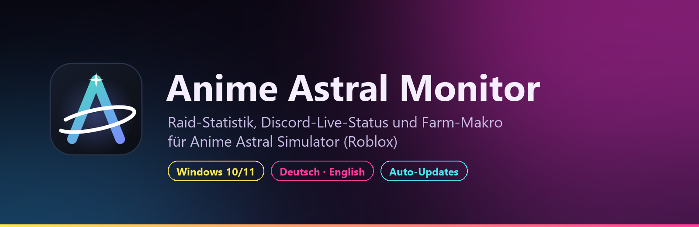
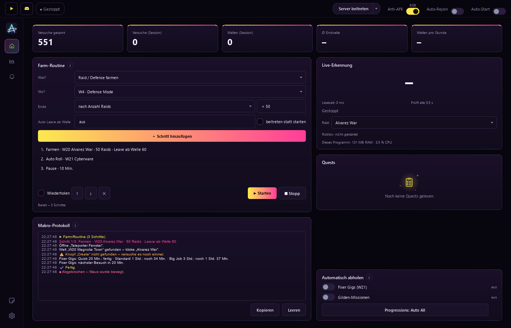
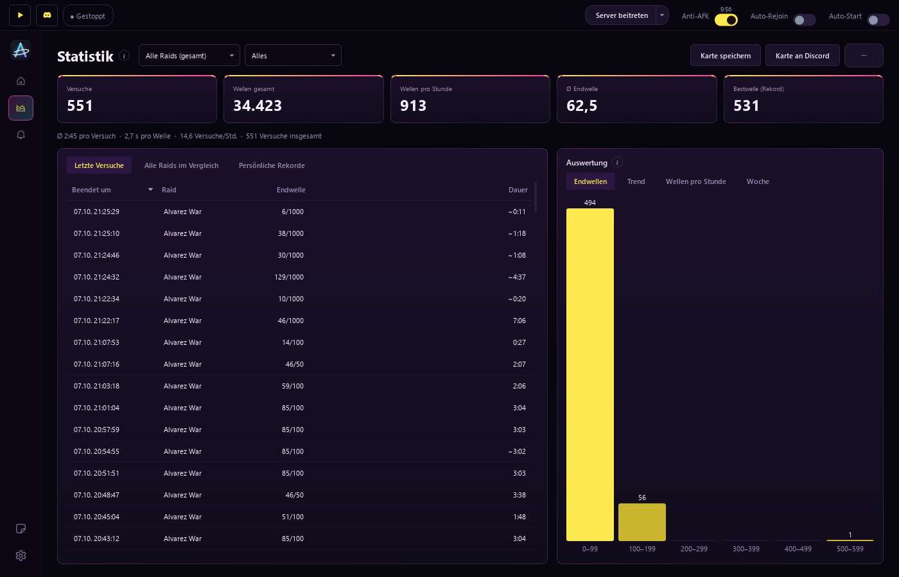
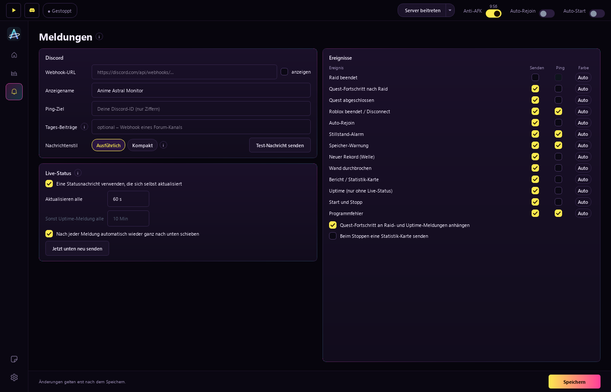

<div align="center">



<br>

[](https://github.com/Justiiiiiin/AnimeAstral/releases)
[](https://github.com/Justiiiiiin/AnimeAstral/releases)
[](#installation)
[](https://github.com/Justiiiiiin/AnimeAstral/actions)

**Dein Begleiter für [Anime Astral Simulator](https://www.roblox.com/games/102072869879193) auf Roblox.**<br>
Zählt jeden Raid und jede Welle, schreibt alles live nach Discord, holt dich nach einem Disconnect zurück
und farmt auf Wunsch für dich.

[**⬇ Herunterladen**](https://github.com/Justiiiiiin/AnimeAstral/releases/latest) ·
[Funktionen](#funktionen) · [Bilder](#so-sieht-es-aus) · [Installation](#installation) · [FAQ](#häufige-fragen)

</div>

---

## Funktionen

<table>
<tr>
<td width="50%" valign="top">

### 📊 Raids & Statistik
- Liest den Wellenzähler (`Wave 12/100`) selbst – ohne Einrichtung
- Jeder Raid mit Endwelle und Dauer, getrennt nach Raid oder gesamt
- Wellen pro Stunde, Trend, Rekorde und die **„Wand“** (Boss-Welle)
- Statistik-Karte und **Monatsrückblick** als Bild zum Teilen
- Archiv, Wochenüberblick, Quest-Fortschritt

</td>
<td width="50%" valign="top">

### 💬 Discord
- **Live-Status:** eine Nachricht, die sich selbst aktualisiert
- Meldungen bei Raid-Ende, Rekord, Wand, Quests und Problemen
- Ping nur, wenn es wirklich wichtig ist
- Tages-Beiträge im Forum-Kanal, Profilstatus „Spielt …“
- **Eigener Discord-Bot:** `/status`, `/start`, `/screenshot`, `/makro` …

</td>
</tr>
<tr>
<td width="50%" valign="top">

### 🛡️ Immer im Spiel
- **Privater Server** mit einem Klick – ohne Browser
- **Auto-Rejoin** nach Disconnect, Kick oder Absturz
- **Anti-AFK** gegen die Trennung nach 20 Minuten
- **Auto-Start**, sobald du das Spiel betrittst
- Wächter für Abstürze, Stillstand und Speicher

</td>
<td width="50%" valign="top">

### 🤖 Makro (Beta)
- **Farm-Routine:** Raids und Defense farmen, Auto Roll, Pausen
- **Automatisch abholen:** Fixer Gigs, Gilden-Missionen, Progressions
- **Erkunden:** lernt alle Welten und Fenster selbst kennen
- Not-Aus per Mausbewegung oder Esc, gefährliche Knöpfe sind tabu
- Ausführliches Makro-Protokoll

</td>
</tr>
</table>

Dazu: Designs wie **Night City**, Nebula, OLED und Saison-Designs, hell/dunkel, eigene Akzentfarbe und
Hintergrundbild, globale Hotkeys, Tray-Symbol, Deutsch und Englisch – und **automatische Updates**, die meist nur
wenige MB groß sind.

## So sieht es aus

<div align="center">


<sub><b>Startseite</b> – Farm-Routine, Makro-Protokoll, Live-Erkennung und automatisches Abholen</sub>

<br><br>


<sub><b>Statistik</b> – alle Raids, Endwellen, Trend und Rekorde</sub>

<br><br>

<table>
<tr>
<td width="50%"><br><sub><b>Meldungen</b> – was an Discord geht und wann gepingt wird</sub></td>
<td width="50%"><br><sub><b>Makro</b> – Erkunden und Protokoll</sub></td>
</tr>
</table>

</div>

## Installation

1. Auf **[Releases](https://github.com/Justiiiiiin/AnimeAstral/releases/latest)** die Datei
   `AnimeAstralMonitor-Setup-….exe` herunterladen und starten.
2. Meldet Windows „Der Computer wurde durch Windows geschützt“: **Weitere Informationen → Trotzdem ausführen**
   (das Programm ist nicht kostenpflichtig signiert).
3. Der Einrichtungsassistent führt dich in etwa einer Minute durch alles: Roblox verbinden, Wellenzähler finden,
   Discord-Webhook eintragen.

Mehr braucht es nicht – die Texterkennung ist enthalten. Windows 10 oder 11, 64 Bit.

> [!TIP]
> Updates kommen von selbst: Das Programm prüft beim Start auf neue Versionen und lädt meist nur die geänderten
> Dateien. Unter **Einstellungen → Programm → Alle Versionen** findest du alle Änderungen und kannst bei Bedarf zu
> einer älteren Version zurück.

## Häufige Fragen

<details>
<summary><b>Belastet das Programm meinen PC?</b></summary>

Kaum. Gemessen mit laufendem Raid: rund 1–2 % eines CPU-Kerns und etwa 50–120 MB Arbeitsspeicher. Es liest nur,
wenn sich das Bild ändert, und zeichnet nichts, solange das Fenster minimiert ist.
</details>

<details>
<summary><b>Muss Roblox im Vordergrund sein?</b></summary>

Für die Überwachung nicht – das Roblox-Fenster darf verdeckt sein, nur nicht minimiert. Anti-AFK und Makro holen
Roblox kurz nach vorne, weil das Spiel Eingaben nur dann annimmt.
</details>

<details>
<summary><b>Ist das Makro erlaubt?</b></summary>

Makros verstoßen gegen die Roblox-Regeln. Das Makro ist deshalb standardmäßig aus und lässt sich nur nach einer
deutlichen Warnung einschalten – die Nutzung geschieht auf eigene Verantwortung. Die reine Überwachung liest nur
das Bild und sendet keine Eingaben an Roblox.
</details>

<details>
<summary><b>Wie bekomme ich einen Discord-Webhook?</b></summary>

In Discord: Kanal bearbeiten → **Integrationen** → **Webhooks** → **Neuer Webhook** → **Webhook-URL kopieren**
und im Assistenten oder unter **Meldungen** einfügen.
</details>

<details>
<summary><b>Kann ich meine Einstellungen auf einen anderen PC mitnehmen?</b></summary>

Ja: **Einstellungen → Programm → Exportieren** erstellt eine passwortgeschützte Datei, die du am neuen PC importierst.
</details>

## Datenschutz

Das Programm sendet Daten nur an die Discord-Webhook-URL, die du selbst einträgst, an GitHub (Update-Prüfung) und –
nur wenn du deinen Roblox-Namen einträgst – an die öffentliche Roblox-Schnittstelle (Avatar, ohne Anmeldung).
Einstellungen und Verlauf liegen lokal in `%APPDATA%\AnimeAstralMonitor`. Webhook-URL, Server-Links und IDs sind
dort mit deinem Windows-Konto verschlüsselt. Es gibt keine Server, kein Konto und keine Werbung.

## Für Entwickler

<details>
<summary>Selbst bauen und testen</summary>

```bash
pip install -r requirements.txt
python run.py                              # starten
python -m unittest discover -s tests -v    # Tests (ohne Roblox, Qt oder Netz)
python build_exe.py                        # EXE lokal bauen
```

Neue Version: `astral_monitor/version.py` anheben, Abschnitt `## X.Y.Z` in `CHANGELOG.md` ergänzen und den Tag
`vX.Y.Z` pushen – GitHub Actions baut Programm, Installer, Update-Paket und Versionshinweise automatisch.
Python 3.12, PySide6, OpenCV, Tesseract.
</details>

---

<div align="center">
<sub>Inoffizielles Fan-Werkzeug – keine Verbindung zu Roblox oder den Entwicklern von Anime Astral Simulator.
Nutzung auf eigene Verantwortung.</sub>
</div>
