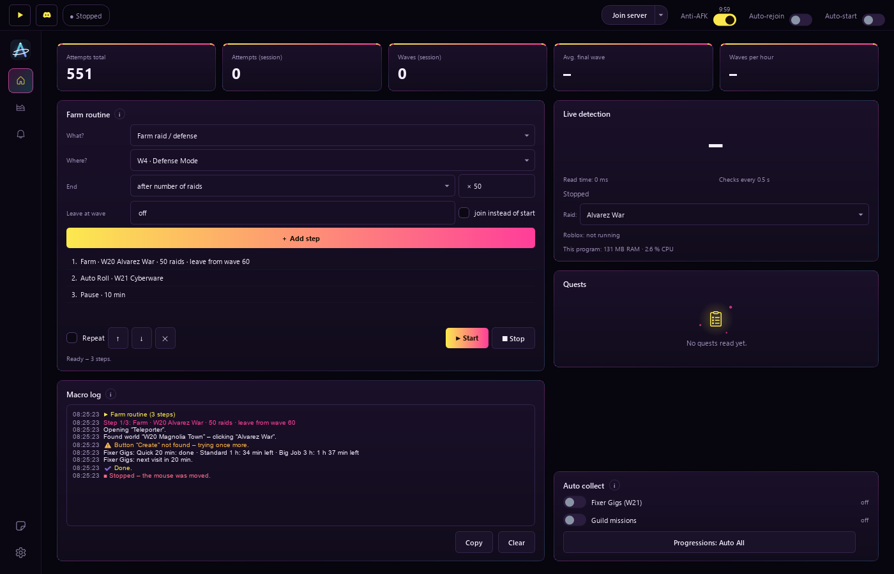
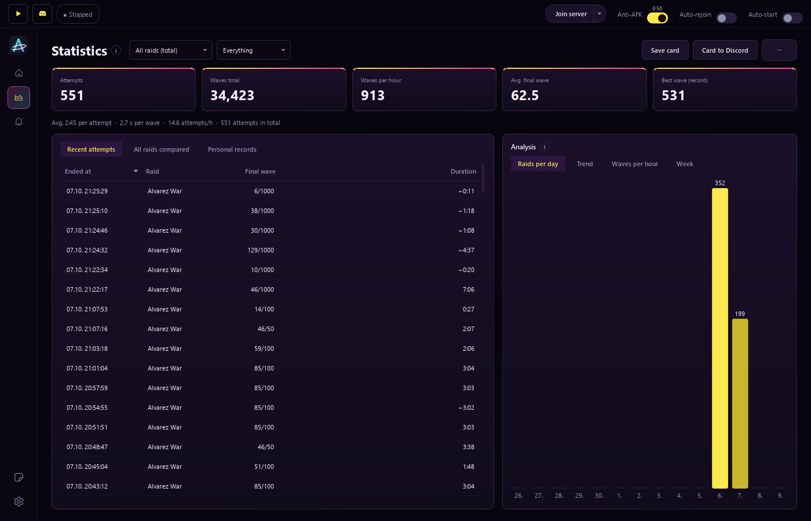
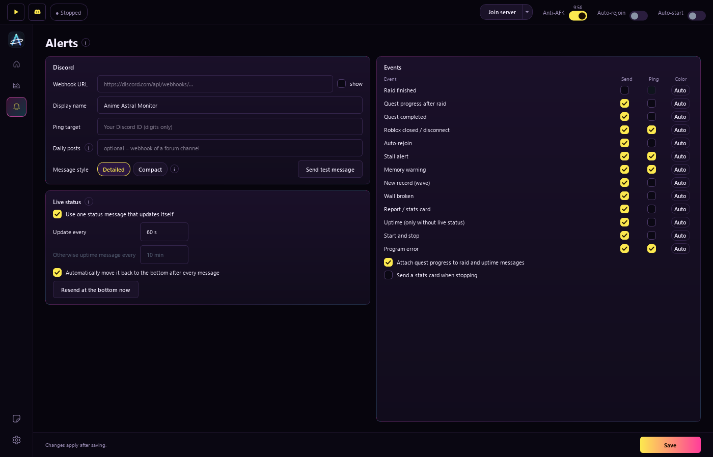
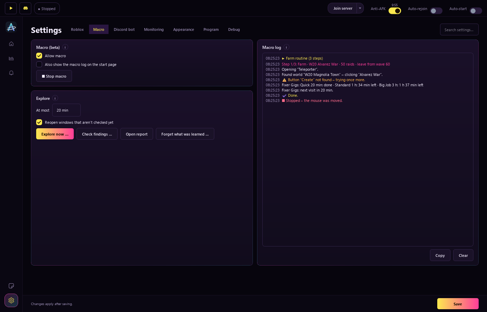

<div align="center">


<br>

[](https://github.com/Justiiiiiin/AnimeAstral/releases)
[](https://github.com/Justiiiiiin/AnimeAstral/releases)
[](#installation)
[](https://github.com/Justiiiiiin/AnimeAstral/actions)

**Your companion for [Anime Astral Simulator](https://www.roblox.com/games/102072869879193) on Roblox.**<br>
Counts every raid and every wave, posts everything live to Discord, gets you back in after a disconnect
and farms for you if you want it to.

[**⬇ Download**](https://github.com/Justiiiiiin/AnimeAstral/releases/latest) ·
[Features](#features) · [Screenshots](#screenshots) · [Installation](#installation) · [FAQ](#faq)

</div>

---

## Features

<table>
<tr>
<td width="50%" valign="top">

### 📊 Raids & statistics
- Reads the wave counter (`Wave 12/100`) by itself – no setup needed
- Every raid with its final wave and duration, per raid or in total
- Raids per day, waves per hour, trend, records and the **“wall”** (boss wave)
- Stats card and **monthly recap** as images to share
- Archive, weekly overview, quest progress

</td>
<td width="50%" valign="top">

### 💬 Discord
- **Live status:** one message that keeps itself up to date
- Alerts for raid end, records, walls, quests and problems
- Pings only when it really matters
- Daily posts in a forum channel, “Playing …” profile status
- **Your own Discord bot:** `/status`, `/start`, `/screenshot`, `/macro` …

</td>
</tr>
<tr>
<td width="50%" valign="top">

### 🛡️ Always in the game
- **Private server** with one click – no browser
- **Auto-rejoin** after a disconnect, kick or crash
- **Anti-AFK** against the 20-minute idle kick
- **Auto-start** as soon as you join the game
- Guard for crashes, stalls and memory

</td>
<td width="50%" valign="top">

### 🤖 Macro (beta)
- **Farm routine:** farm raids and defense, Auto Roll, pauses
- **Auto collect:** Fixer Gigs, guild missions, Progressions
- **Explore:** learns all worlds and windows by itself
- Emergency stop by moving the mouse or pressing Esc; dangerous buttons are off-limits
- Detailed macro log

</td>
</tr>
</table>

Plus: designs like **Night City**, Nebula, OLED and seasonal themes, light/dark, your own accent color and
background image, global hotkeys, a tray icon, English and German – and **automatic updates** that are usually
just a few MB.

## Screenshots

<div align="center">


<sub><b>Start page</b> – farm routine, macro log, live detection and auto collect</sub>

<br><br>


<sub><b>Statistics</b> – every raid, raids per day, trend and records</sub>

<br><br>

<table>
<tr>
<td width="50%"><br><sub><b>Alerts</b> – what goes to Discord and when you get pinged</sub></td>
<td width="50%"><br><sub><b>Macro</b> – explore and log</sub></td>
</tr>
</table>

</div>

## Installation

1. Download `AnimeAstralMonitor-Setup-….exe` from
   **[Releases](https://github.com/Justiiiiiin/AnimeAstral/releases/latest)** and run it.
2. If Windows says “Windows protected your PC”: **More info → Run anyway**
   (the program isn't signed with a paid certificate).
3. The setup wizard walks you through everything in about a minute: connect Roblox, find the wave counter,
   enter your Discord webhook.

That's all – text recognition is included. Windows 10 or 11, 64-bit.

> [!TIP]
> Updates arrive by themselves: the program checks for new versions at startup and usually downloads only the
> changed files. Under **Settings → Program → All versions** you can see every change and go back to an older
> version if you need to.

## FAQ

<details>
<summary><b>Does it slow down my PC?</b></summary>

Hardly. Measured during a raid: about 1–2 % of one CPU core and roughly 50–120 MB of memory. It only reads when
the picture changes and draws nothing while its window is minimized.
</details>

<details>
<summary><b>Does Roblox have to be in the foreground?</b></summary>

Not for monitoring – the Roblox window may be covered, just not minimized. Anti-AFK and the macro bring Roblox to
the front briefly, because the game only accepts input then.
</details>

<details>
<summary><b>Is the macro allowed?</b></summary>

Macros break the Roblox rules. That's why the macro is off by default and can only be turned on after a clear
warning – using it is at your own risk. Plain monitoring only reads the picture and sends no input to Roblox.
</details>

<details>
<summary><b>How do I get a Discord webhook?</b></summary>

In Discord: Edit channel → **Integrations** → **Webhooks** → **New Webhook** → **Copy Webhook URL**, then paste
it in the wizard or under **Alerts**.
</details>

<details>
<summary><b>Can I take my settings to another PC?</b></summary>

Yes: **Settings → Program → Export** creates a password-protected file that you import on the new PC.
</details>

<details>
<summary><b>Can I use it in German?</b></summary>

Yes: **Settings → Appearance → Sprache / Language**. The change applies after a restart.
</details>

## Privacy

The program only sends data to the Discord webhook URL you enter yourself, to GitHub (update check) and – only if
you enter your Roblox name – to the public Roblox API (avatar, no login). Settings and history are stored locally in
`%APPDATA%\AnimeAstralMonitor`. Webhook URL, server links and IDs are encrypted there with your Windows account.
No servers, no account, no ads.

## For developers

<details>
<summary>Build and test it yourself</summary>

```bash
pip install -r requirements.txt
python run.py                              # start
python -m unittest discover -s tests -v    # tests (no Roblox, Qt or network needed)
python build_exe.py                        # build the EXE locally
```

New version: bump `astral_monitor/version.py`, add a `## X.Y.Z` section to `CHANGELOG.md` and push the tag
`vX.Y.Z` – GitHub Actions builds the program, installer, update package and release notes automatically.
Python 3.13, PySide6, OpenCV, Tesseract. UI texts are written in English in the code (`tr()`); the German
translation lives in `astral_monitor/i18n_de.py`.
</details>

---

<div align="center">
<sub>Unofficial fan tool – not affiliated with Roblox or the developers of Anime Astral Simulator.
Use at your own risk.</sub>
</div>
